# Planning-and-Learning-in-Robotics

PR1: Making an agent get treasure with lowest cost in a Door & Key Environment by defining the problem as a deterministic shortest path problem (DSP) and using Label Correcting (LC) algorithm .

PR2: Implementing search-based planning algorithm(RTAA*) in 3D Euclidean space to make an agent elude obstacles and reach a final goal and Comparing RTAA* with RTT* algorithm(using existing library)

PR3: Balancing an inverted pendulum using Value Iteration(VI) and Policy Iteration(PI)

PR4(Group Project): Implementing SARSA, Q-learning and Deep Q-learning in Cart-pole and Lunar-lander environment

## PR1: Autonomous navigation in Door&Key Environment

This project implements autonomous navigation in a Door & Key environment to make an agent get treasure with lowest cost using Dynamic Programming algorithm with a known map. There is a key, a door and walls in the map. The agent needs to get the treasure with the lowest cost. The agent has three regular actions - move forward(MF), turn left(TL) and turn right (TR), and two special actions, pick up key(PK) and unlock door(UD).  In this project, I firstly define the problem as a deterministic shortest path problem (DSP) and then use Label Correcting (LC) algorithm to solve the problem.

The Results are demonstrated below:

|     Environment      |                         Results                          |
| :------------------: | :------------------------------------------------------: |
|  Doorkey-5x5-normal  |   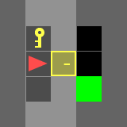   |
|  Doorkey-6x6-normal  |      |
|  Doorkey-6x6-direct  |   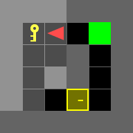   |
| Doorkey-6x6-shortcut | 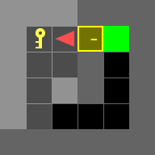 |
|  Doorkey-8x8-normal  |   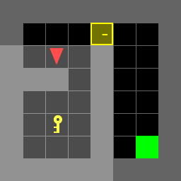   |
|  Doorkey-8x8-direct  |   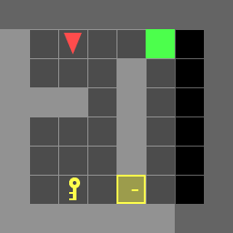   |
| Doorkey-8x8-shortcut | 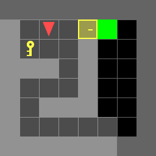 |
| Doorkey-8x8-example  |            |

More analysis for each states please refer to folder:

```
./results_demo/PR1_results_analysis
```


## PR2: Implementing search-based planning algorithms in 3D Euclidean space, comparing the performance with sampling-based planning algorithms

This project implements search-based and sampling-based planning algorithms in 3D Euclidean space to make an agent elude collision and reach a final goal. RTAA* and RRT* algorithm are chosen to solve this problem and finally the project compares their performance. The RTAA* is implemented by myself and RRT* algorithm is modified based on  **https://github.com/motion-planning/rrt-algorithms**. In this project, I also wrote my own collision checking algorithm to check collision. 

The results in different maps are demonstrated below:

| MAP         | RTAA* results                                                | RRT* results                                                 |
| ----------- | ------------------------------------------------------------ | ------------------------------------------------------------ |
| flappy_bird | 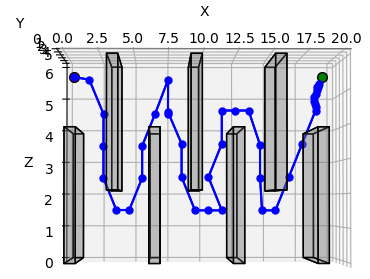 | 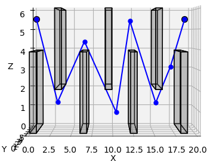 |
| maze        | 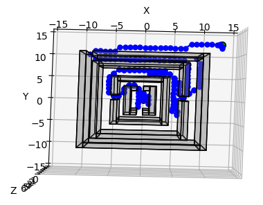       | 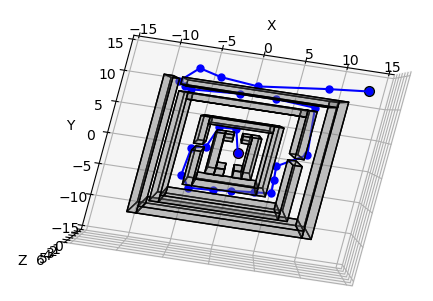         |
| monza       | 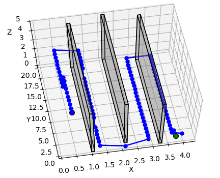     | 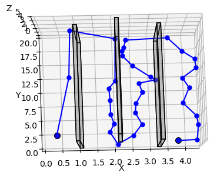       |
| Room        | 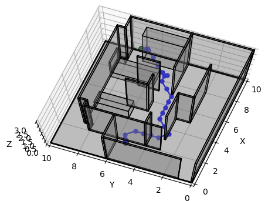        | 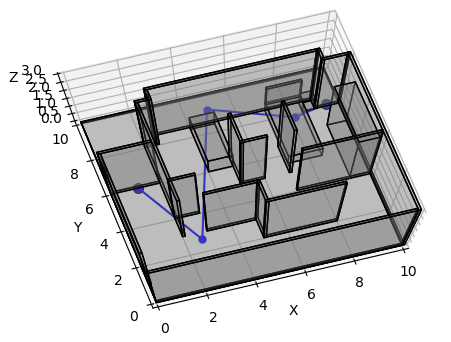         |
| single cube | 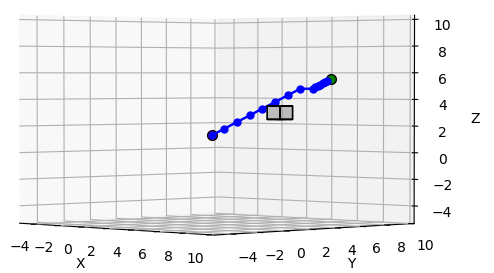 | 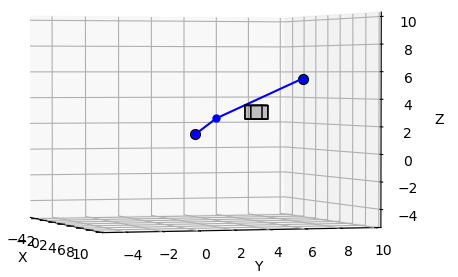 |
| Tower       | 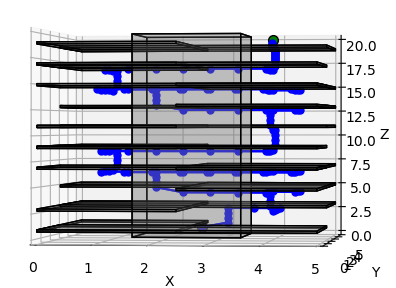     | 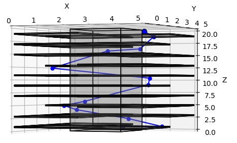      |
| Window      | 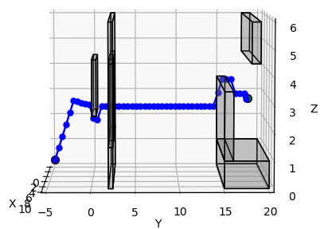   | 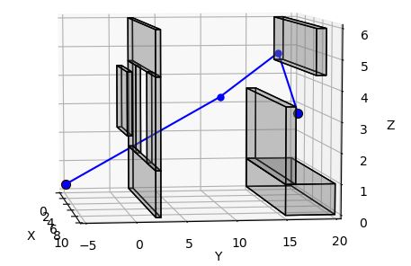     |

A 3D rotational verion please refer to 

```
./results_demo/PR2_rotate
```


## PR3: Balancing an inverted pendulum using Value Iteration(VI) and Policy Iteration(PI)

This project implements inverting pendulum using Policy Iteration and Value Iteration. The inverting pendulum problem is formulated as an inifinite-horizon discounted stochastic optimal control problem. Then I compare between PI and VI algorithms by using some visualization. Finally, I play with different paramters to see their impact on performance.

Some results with different parameters are demonstrated below:

| Parameters                        |                          PI Results                          |                          VI results                          |
| --------------------------------- | :----------------------------------------------------------: | :----------------------------------------------------------: |
| My Baseline                       |        |        |
| Best Case                         |        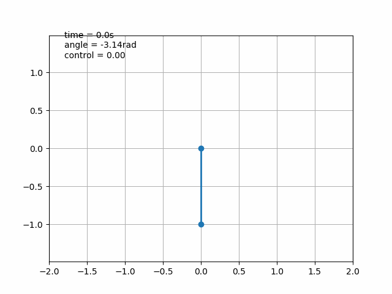        |                |
| Different Starting position       | Starts with pi/2: 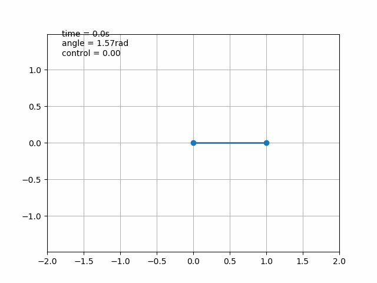 | Starts with -pi/2: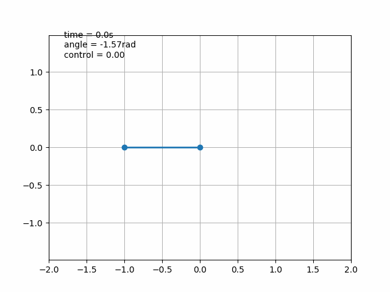 |
| Different Starting position       | Starts with 3pi/4: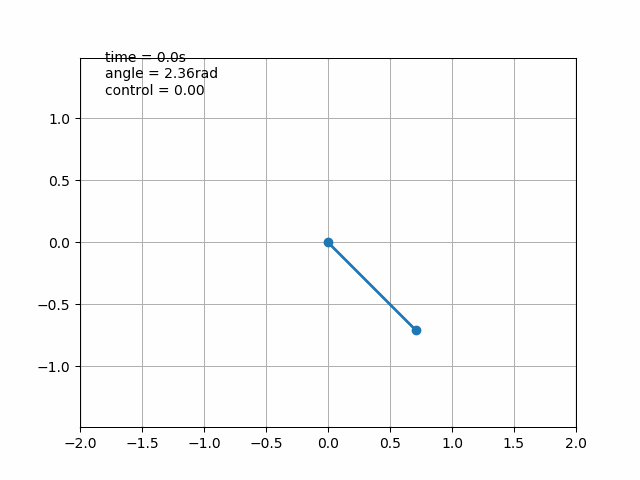 | Starts with -4pi/5: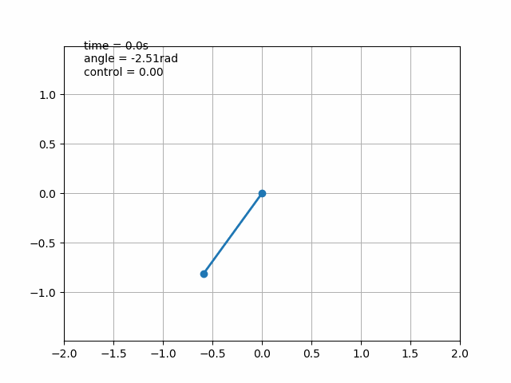 |
| Large noise leads to failure case |  |  |


## PR4: Reinforcement Learning - implement SARSA, Q-learning and Deep Q-learning

My partner and I implement this project together.  In this project, we implement SARSA, Q-learning and Deep Q-learning to avoid a cart-pole failing down. Also, we implement these three algorithms to guide a lunar lander landing on a desired position. Finally, we compare and evaluation these three algorithms on these different environments.

The results are demonstrated below:

| Algorithm       | CartPole                                             | LunarLander                                              |
| --------------- | ---------------------------------------------------- | -------------------------------------------------------- |
| SARSA           | 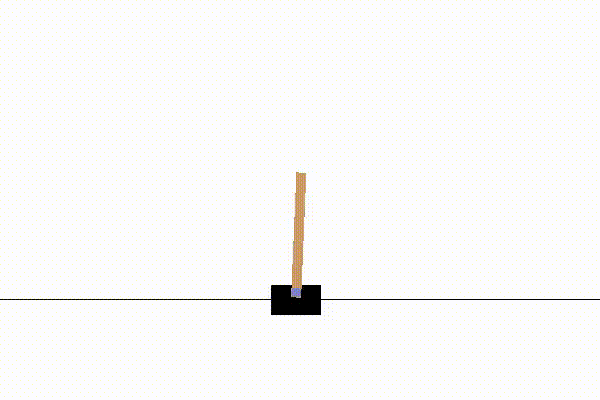 | 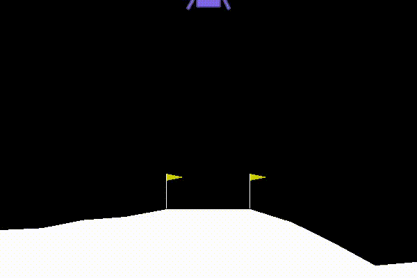 |
| Q-Learning      | 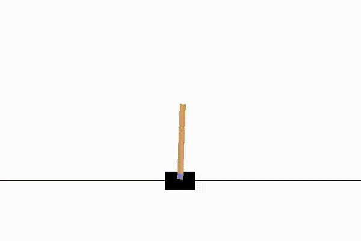       | 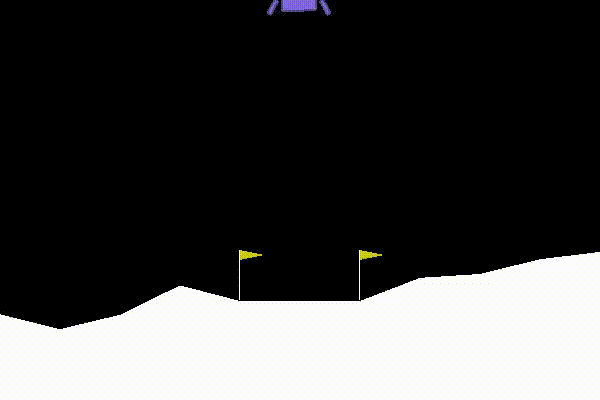       |
| Deep Q-Learning | 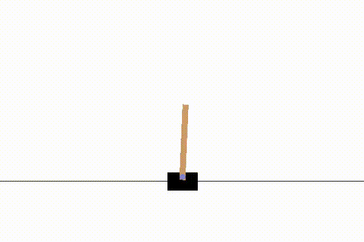     | 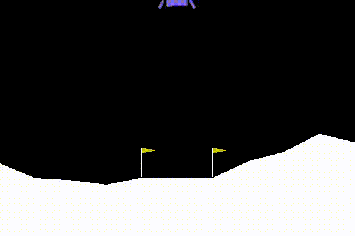     |

